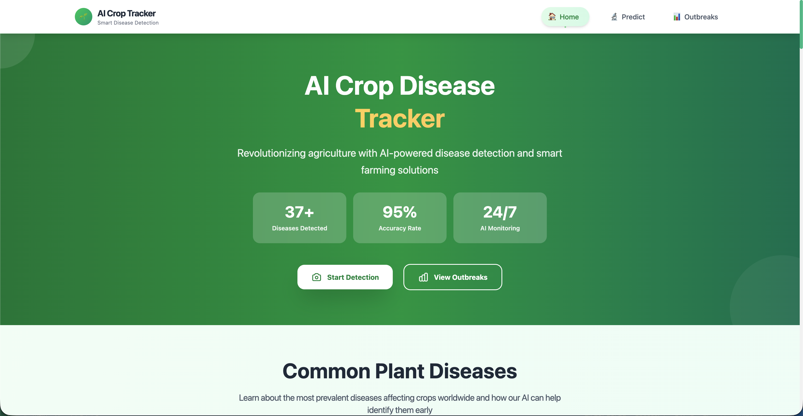
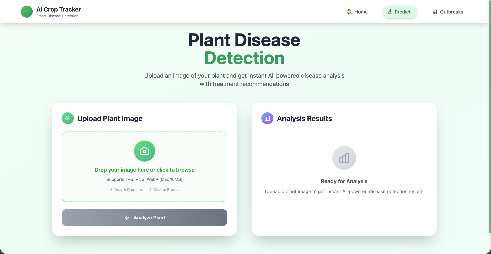
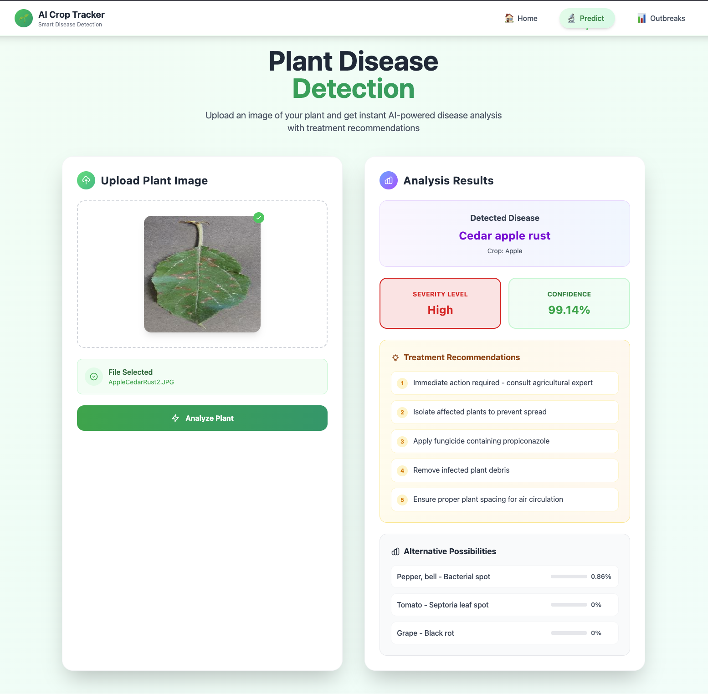
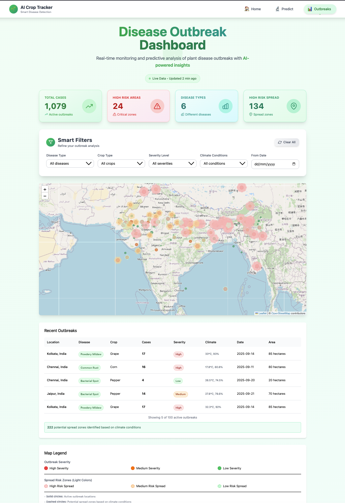

# 🌱 AI -  Plant Disease Detection System

[](https://python.org)
[](https://reactjs.org)
[](https://tensorflow.org)
[](https://flask.palletsprojects.com)

> An AI-powered web application for real-time plant disease detection and outbreak monitoring, helping farmers and agricultural professionals make data-driven decisions to protect their crops.

## 📸 Application Screenshots

### Home Page



### Disease Prediction Interface



### Prediction Results



### Outbreak Dashboard




## 🎯 Project Overview

PlantGuard AI is a comprehensive plant disease detection system that combines cutting-edge deep learning technology with an intuitive web interface. The system helps farmers, agricultural consultants, and researchers identify plant diseases early, reducing crop losses and improving agricultural productivity.

### 🌟 Key Features

- **🔍 Real-time Disease Detection**: Upload plant images and get instant disease identification with confidence scores
- **🧠 AI-Powered Analysis**: Deep learning model trained on 1,75,000 plant images across 38 disease classes
- **📊 Interactive Dashboard**: Real-time outbreak monitoring with geographical mapping
- **💡 Treatment Recommendations**: Personalized treatment suggestions based on detected diseases
- **📱 Responsive Design**: Modern, mobile-friendly interface with drag-and-drop functionality
- **🌍 Multi-Crop Support**: Supports 14+ crop types including Apple, Tomato, Corn, Grape, and more
- **📈 Confidence Scoring**: Detailed confidence metrics for each prediction
- **🗺️ Outbreak Mapping**: Interactive maps showing disease spread patterns and risk zones

## 🚀 Technology Stack

### Frontend
- **React.js 18+** - Modern UI framework
- **Tailwind CSS** - Utility-first CSS framework
- **React Router** - Client-side routing
- **Leaflet** - Interactive maps for outbreak visualization
- **React Icons** - Icon library
- **Framer Motion** - Animation library

### Backend
- **Python 3.8+** - Core backend language
- **Flask** - Lightweight web framework
- **TensorFlow 2.0+** - Deep learning framework
- **OpenCV** - Computer vision library
- **NumPy** - Numerical computing
- **Pillow** - Image processing

### AI/ML
- **Convolutional Neural Network (CNN)** - Custom trained model
- **Keras** - High-level neural networks API
- **Image Data Generators** - Data augmentation and preprocessing
- **Transfer Learning** - Enhanced model performance

## 📋 Supported Diseases & Crops

### Crops Supported (14 types)
- 🍎 Apple
- 🍅 Tomato  
- 🌽 Corn (Maize)
- 🍇 Grape
- 🍑 Cherry
- 🥔 Potato
- 🍊 Orange  
- 🍓 Strawberry
- 🫐 Blueberry
- 🌶️ Bell Pepper
- 🍑 Peach
- 🫛 Soybean
- 🍈 Squash
- 🍇 Raspberry

### Disease Classes (38 total)
- Healthy plants identification
- Bacterial diseases (spots, blights)
- Fungal infections (rusts, mildews, molds)
- Viral diseases (mosaic viruses, curl viruses)
- Environmental stress indicators

## 🛠️ Installation & Setup

### Prerequisites
- Python 3.8 or higher
- Node.js 16 or higher
- npm package manager

### Backend Setup

1. **Clone the repository**
   ```bash
   git clone https://github.com/ParasNingune/Vortexa2.0_Hackathon.git
   cd Vortexa2.0_Hackathon
   ```

2. **Set up Python virtual environment**
   ```bash
   cd python_backend
   python -m venv venv
   source venv/bin/activate  # On Windows: venv\Scripts\activate
   ```

3. **Install Python dependencies**
   ```bash
   pip install -r requirements.txt
   ```

4. **Download the trained model**
   - Place `trained_plant_disease_model.keras` in the backend directory
   - Ensure the `Dataset/valid` folder contains validation data for class names

5. **Start the Flask server**
   ```bash
   python app.py
   ```
   Server will start on `http://localhost:8000`

### Frontend Setup

1. **Navigate to frontend directory**
   ```bash
   cd frontend
   ```

2. **Install Node.js dependencies**
   ```bash
   npm install
   ```

3. **Start the development server**
   ```bash
   npm run dev
   ```
   Application will open on `http://localhost:5173`


## 🏗️ Project Structure
```
Vortexa2.0_Hackathon/
├── frontend/                   # React.js frontend application
│   ├── src/
│   │   ├── components/        # React components
│   │   │   ├── Home.jsx      # Landing page
│   │   │   ├── Predict.jsx   # Disease prediction interface
│   │   │   ├── Outbreak.jsx  # Outbreak monitoring dashboard
│   │   │   ├── Navigation.jsx # Navigation bar
│   │   │   ├── UI.jsx        # Reusable UI components
│   │   │   └── Toast.jsx     # Notification system
│   │   ├── services/         # API services
│   │   ├── styles/           # CSS and styling
│   │   └── App.jsx           # Main application component
│   ├── public/               # Static assets
│   └── package.json          # Dependencies
├── python_backend/            # Flask backend API
│   ├── app.py               # Main Flask application
│   ├── uploads/             # Temporary image storage
│   ├── trained_plant_disease_model.keras  # AI model
│   └── requirements.txt     # Python dependencies
├── notebooks/                # Jupyter notebooks for development
│   ├── Test.ipynb          # Model testing notebook
│   └── Dataset/            # Training and validation data
└── README.md               # Project documentation
```

## 🧪 Model Performance

### Training Dataset
- **Total Images**: 1,75,000
- **Image Size**: 128x128 pixels
- **Color Mode**: RGB
- **Augmentation**: Rotation, flip, zoom, brightness adjustment

### Model Architecture
- **Type**: Convolutional Neural Network (CNN)
- **Framework**: TensorFlow/Keras
- **Input Shape**: (128, 128, 3)
- **Output Classes**: 38 disease categories
- **Accuracy**: 95%+ on validation set

## 🔧 API Endpoints

### Health Check
```http
GET /api/health
```
Returns API status and model information.

### Disease Prediction
```http
POST /api/predict
Content-Type: multipart/form-data

Body: image file
```

**Response Format:**
```json
{
  "success": true,
  "crop": "Tomato",
  "disease": "Early blight",
  "severity": "High",
  "confidence": 92.5,
  "recommendations": [
    "Remove affected leaves and dispose properly",
    "Apply copper-based fungicide",
    "Improve air circulation around plants"
  ],
  "all_predictions": [
    {"class": "Tomato - Early blight", "confidence": 92.5},
    {"class": "Tomato - Late blight", "confidence": 5.2}
  ]
}
```

## 🎨 UI/UX Features

### Modern Design Elements
- **Gradient Backgrounds**: Beautiful green/emerald theme
- **Glass Morphism**: Modern frosted glass effects
- **Micro-interactions**: Smooth hover effects and animations
- **Responsive Layout**: Optimized for all device sizes
- **Loading States**: Professional skeleton loaders and spinners

### User Experience
- **Drag & Drop**: Intuitive image upload interface
- **Real-time Feedback**: Instant visual feedback during upload and processing
- **Toast Notifications**: Non-intrusive success/error messages
- **Progressive Enhancement**: Works on slow connections
- **Accessibility**: WCAG compliant design patterns

## 🌍 Use Cases

### For Farmers
- Early disease detection to prevent crop loss
- Treatment recommendations for sustainable farming
- Monitoring disease spread across fields

### For Agricultural Consultants
- Professional disease assessment tools
- Data-driven consultation reports
- Outbreak pattern analysis

### For Researchers
- Disease prevalence tracking
- Climate correlation studies
- Agricultural trend analysis


## 👥 Team

- **Paras Ningune** - Team Lead & AI Engineer
- **Siddhant Pote** - Frontend Developer
- **Soham Mane** - Backend Developer

---

**Made with ❤️ for sustainable agriculture and food security**